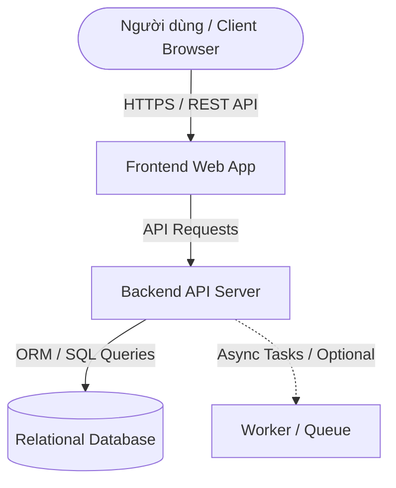

# TÀI LIỆU THIẾT KẾ KIẾN TRÚC HỆ THỐNG (SYSTEM ARCHITECTURE DESIGN) 🏛

> **Dự án**: `<Tên Dự Án>`  
> **Kiến trúc sư phụ trách**: `Architecture Employee (AI Agent)`  
> **Giai đoạn áp dụng**: `Giai đoạn 1 (Core Architecture)`

---

## 🏗 1. TỔNG QUAN KIẾN TRÚC (HIGH-LEVEL DESIGN - HLD)

### 1.1. Mô hình Kiến trúc Lựa chọn
- **Mô hình**: `<Monolith / Modular Monolith / Microservices / Clean Architecture>`
- **Lý do lựa chọn**:
  - Phù hợp với quy mô MVP Giai đoạn 1.
  - Tối ưu thời gian triển khai, giảm độ phức tạp vận hành.

### 1.2. Sơ Đồ Khối Tổng Thể (System Architecture Diagram)

---

## 🛠 2. BẢNG CÔNG NGHỆ CHÍNH (TECH STACK SPECIFICATION)

| Lớp (Layer) | Công nghệ đề xuất | Phiên bản | Lý do & Mục đích |
| :--- | :--- | :--- | :--- |
| **Frontend** | React / Next.js / Vue / HTML5 | Latest | Xây dựng giao diện responsive, tương tác mượt mà |
| **Backend** | Node.js (Express/NestJS) / Python (FastAPI) | Latest | Xử lý logic nghiệp vụ, API RESTful nhẹ và nhanh |
| **Database** | PostgreSQL / MySQL / SQLite | Latest | Lưu trữ dữ liệu quan hệ, đảm bảo tính toàn vẹn (ACID) |
| **Styling** | Vanilla CSS / CSS Modules | Latest | Linh hoạt cao, giao diện thẩm mỹ hiện đại |

---

## 🔄 3. LUỒNG DỮ LIỆU TỔNG THỂ (DATA FLOW)

1. **Client Request**: Người dùng gửi yêu cầu từ giao diện Frontend.
2. **Controller / Handler**: Backend tiếp nhận, validate dữ liệu đầu vào.
3. **Service Layer**: Thực thi nghiệp vụ cốt lõi (Business Logic).
4. **Data Access Layer**: Tương tác với Database thực hiện CRUD.
5. **Response Format**: Trả về dữ liệu chuẩn định dạng JSON (`{ success: true, data: ..., error: null }`).

---

## ⚠️ 4. ĐIỂM CẢNH BÁO BẢO MẬT & HIỆU NĂNG CHO GIAI ĐOẠN 2 & 3

- 🔒 **Giai đoạn 2 (Security)**: Phân quyền API theo Role/Permission, mã hóa dữ liệu nhạy cảm (Cần phê duyệt khi làm).
- ⚡ **Giai đoạn 3 (Performance)**: Thêm Redis Caching giữa Backend và Database khi số lượng request tăng cao (Cần phê duyệt khi làm).
