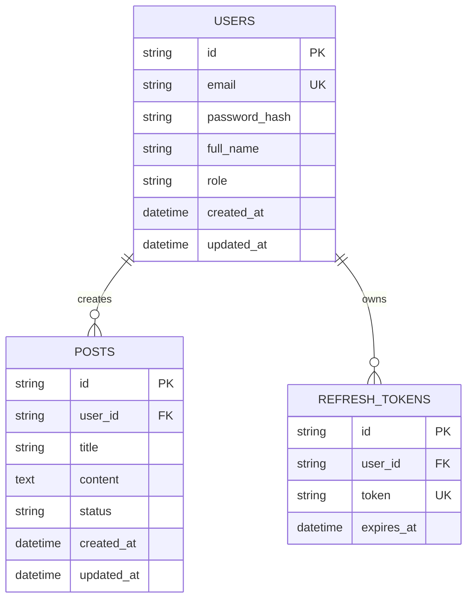

# TÀI LIỆU THIẾT KẾ CƠ SỞ DỮ LIỆU (DATABASE SCHEMA & ERD DESIGN) 🗄

> **Dự án**: `<Tên Dự Án>`  
> **Kỹ sư Cơ sở dữ liệu phụ trách**: `Database Employee (AI Agent)`  
> **Giai đoạn áp dụng**: `Giai đoạn 1 (Core Relational Schema & Integrity)`

---

## 📊 1. SƠ ĐỒ THỰC THỂ LIÊN KẾT (ERD DIAGRAM)



---

## 📑 2. TỪ ĐIỂN DỮ LIỆU CHI TIẾT (DATA DICTIONARY)

### 2.1. Bảng `users` (Quản lý người dùng)

| Tên Cột | Kiểu Dữ Liệu | Nullable | Mặc Định | Ràng Buộc (Constraints) | Mô Tả |
| :--- | :--- | :---: | :--- | :--- | :--- |
| `id` | `VARCHAR(36)` | ❌ | `UUID()` | PRIMARY KEY | Khóa chính |
| `email` | `VARCHAR(255)`| ❌ | - | UNIQUE, INDEX | Địa chỉ email đăng nhập |
| `password_hash`| `VARCHAR(255)`| ❌ | - | - | Mật khẩu đã băm (bcrypt/argon2) |
| `full_name` | `VARCHAR(100)`| ❌ | - | - | Họ và tên người dùng |
| `role` | `VARCHAR(20)` | ❌ | `'user'` | - | Vai trò (`admin`, `user`) |
| `created_at` | `TIMESTAMP` | ❌ | `NOW()` | - | Thời gian tạo tài khoản |
| `updated_at` | `TIMESTAMP` | ❌ | `NOW()` | - | Thời gian cập nhật gần nhất |

---

## 📝 3. KỊCH BẢN TẠO SCHEMA (SCHEMA DDL SCRIPT)

```sql
-- Kịch bản khởi tạo bảng Users (Giai đoạn 1)
CREATE TABLE IF NOT EXISTS users (
    id VARCHAR(36) PRIMARY KEY,
    email VARCHAR(255) UNIQUE NOT NULL,
    password_hash VARCHAR(255) NOT NULL,
    full_name VARCHAR(100) NOT NULL,
    role VARCHAR(20) DEFAULT 'user' NOT NULL,
    created_at TIMESTAMP DEFAULT CURRENT_TIMESTAMP NOT NULL,
    updated_at TIMESTAMP DEFAULT CURRENT_TIMESTAMP NOT NULL
);

-- Chỉ mục cơ bản hỗ trợ tìm kiếm nhanh
CREATE INDEX IF NOT EXISTS idx_users_email ON users(email);
```

---

## ⚡ 4. CHECKPOINT TỐI ƯU HIỆU NĂNG CHO GIAI ĐOẠN 3 (PERFORMANCE CHECKPOINT)
- 🟣 *Giai đoạn 3 (Cần phê duyệt)*: Đánh Composite Index đa cột cho các truy vấn phức tạp, Partitioning theo thời gian (ví dụ bảng Logs lớn), thiết lập Read Replica hoặc Sharding khi dữ liệu vượt 1 triệu bản ghi.
