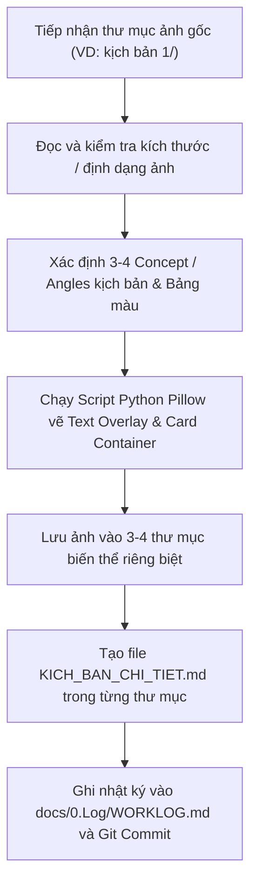

# Skill: Tự Động Render Ảnh Chèn Chữ Đa Biến Thể TikTok (`tiktok-overlay-generator`) 🖼️🎨📱✨

Skill này chuyên trách tự động hóa quy trình **Visual Design & Batch Image Overlay** cho các chiến dịch nội dung TikTok / Reels / Shorts. Sử dụng thư viện `Pillow` (Python) để tự động vẽ các khung card chứa nội dung, viền màu sắc bắt mắt, header badge bo góc, và chèn văn bản tiếng Việt UTF-8 sắc nét lên hàng loạt ảnh chụp màn hình, sau đó xuất ra **3–4 thư mục biến thể kịch bản** kèm file `KICH_BAN_CHI_TIET.md` sẵn sàng tải lên mạng xã hội ngay lập tức.

---

## 🎯 Mục Tiêu & Lợi Ích

1. **Tự động hóa 100% việc chèn chữ lên ảnh**: Không cần mở Canva hay Photoshop chỉnh sửa từng ảnh bằng tay.
2. **Xuất hàng loạt 3–4 góc độ kịch bản (Marketing Angles)**:
   - **Bản 1 (FOMO Call-out)**: Kêu gọi sinh viên trực diện (*"Sinh viên mà chưa biết cái này..."*), viền vàng Amber `(245, 158, 11)`.
   - **Bản 2 (Tech Aesthetic / Dân IT)**: Đánh vào tính năng công nghệ, GitHub heatmap, Google Calendar (*"Khi dân IT tự code TKB..."*), viền xanh Neon Cyan `(34, 211, 238)`.
   - **Bản 3 (Pain-solver Mùa thi)**: Đánh vào nỗi sợ trượt môn, tính điểm, chạy deadline (*"Mùa thi tới nơi mà không biết cái này là toang..."*), viền đỏ cam Coral `(239, 68, 68)`.
   - **Bản 4 (Relatable Habit)**: Đánh vào thói quen bất tiện (*"Bỏ ngay trò chụp màn hình TKB..."*), viền xanh ngọc Emerald `(16, 185, 129)`.
3. **Chuẩn hóa đồ họa cao cấp (Rich Aesthetics)**:
   - Khung Card nền tối bán trong suốt (Dark Slate `rgba(15, 23, 42, 0.93)`).
   - Badge tiêu đề có viền màu sắc nét, nền trong mờ.
   - Text Wrap tự động bọc dòng theo kích thước ảnh, căn giữa hoàn hảo.
   - Phông chữ hệ thống Tiếng Việt chuẩn UTF-8 (`Arial Bold` + `Arial Regular` / `Segoe UI`).
4. **Kèm file kịch bản chi tiết**: Mỗi thư mục biến thể đều tự động sinh file `KICH_BAN_CHI_TIET.md` chứa kịch bản Text Overlay từng slide, lời thoại Voiceover, Caption và bộ Hashtags chuẩn SEO TikTok.

---

## 📋 Quy Trình Thực Hiện Chuẩn (Step-by-Step Workflow)



---

## 💻 Cấu Trúc Mã Nguồn Python Mẫu (Pillow Rendering)

```python
import os
import sys
from pathlib import Path
from PIL import Image, ImageDraw, ImageFont

def wrap_text(text, font, max_width, draw):
    words = text.split(' ')
    lines = []
    current_line = []
    for word in words:
        test_line = ' '.join(current_line + [word])
        bbox = draw.textbbox((0, 0), test_line, font=font)
        if (bbox[2] - bbox[0]) <= max_width:
            current_line.append(word)
        else:
            if current_line:
                lines.append(' '.join(current_line))
            current_line = [word]
    if current_line:
        lines.append(' '.join(current_line))
    return lines

def render_card_overlay(img, top_text, bottom_text, border_color, font_bold, font_reg):
    img = img.convert("RGBA")
    W, H = img.size
    
    font_size_top = max(24, int(W * 0.038))
    font_size_bottom = max(18, int(W * 0.027))
    
    f_top = ImageFont.truetype(font_bold, font_size_top)
    f_bottom = ImageFont.truetype(font_reg, font_size_bottom)

    overlay = Image.new('RGBA', (W, H), (0, 0, 0, 0))
    draw = ImageDraw.Draw(overlay)
    
    margin_x = int(W * 0.04)
    card_w = W - 2 * margin_x
    max_text_w = card_w - int(W * 0.08)
    
    top_lines = wrap_text(top_text, f_top, max_text_w, draw)
    bottom_lines = wrap_text(bottom_text, f_bottom, max_text_w, draw)
    
    line_h_top = int(font_size_top * 1.35)
    line_h_bottom = int(font_size_bottom * 1.4)
    pad_y = int(H * 0.02)
    badge_pad = int(font_size_top * 0.4)
    
    badge_h = len(top_lines) * line_h_top + badge_pad * 2
    bottom_h = len(bottom_lines) * line_h_bottom
    card_h = badge_h + bottom_h + pad_y * 3
    
    card_x = margin_x
    card_y = int(H * 0.03)
    
    # 1. Vẽ Khung Card Nền
    draw.rounded_rectangle([card_x, card_y, card_x + card_w, card_y + card_h], radius=18, fill=(15, 23, 42, 238), outline=border_color, width=3)
    
    # 2. Vẽ Header Badge
    badge_margin = int(W * 0.03)
    badge_box = [card_x + badge_margin, card_y + pad_y, card_x + card_w - badge_margin, card_y + pad_y + badge_h]
    draw.rounded_rectangle(badge_box, radius=10, fill=(border_color[0], border_color[1], border_color[2], 45), outline=border_color, width=2)
    
    # 3. Vẽ Text Top
    cur_y = card_y + pad_y + badge_pad
    for line in top_lines:
        bbox = draw.textbbox((0, 0), line, font=f_top)
        tx = card_x + (card_w - (bbox[2] - bbox[0])) // 2
        draw.text((tx, cur_y), line, font=f_top, fill=(255, 255, 255, 255))
        cur_y += line_h_top
        
    # 4. Vẽ Text Bottom
    cur_y = card_y + pad_y + badge_h + int(pad_y * 0.8)
    for line in bottom_lines:
        bbox = draw.textbbox((0, 0), line, font=f_bottom)
        tx = card_x + (card_w - (bbox[2] - bbox[0])) // 2
        draw.text((tx, cur_y), line, font=f_bottom, fill=(241, 245, 249, 255))
        cur_y += line_h_bottom

    return Image.alpha_composite(img, overlay).convert("RGB")
```

---

## 🎨 Quy Chuẩn Bảng Màu & Visual Tokens

| Phiên bản | Góc độ truyền thông | Màu viền / Accent | Mã RGB |
| :--- | :--- | :--- | :--- |
| **Bản 1** | FOMO Sinh viên chưa biết | Vàng Amber / Gold | `(245, 158, 11)` |
| **Bản 2** | Dân IT Tự Code / Tech Aesthetic | Xanh Neon Cyan | `(34, 211, 238)` |
| **Bản 3** | Cứu tinh Mùa thi / Tránh trượt môn | Đỏ cam Coral / Sunset | `(239, 68, 68)` |
| **Bản 4** | Bỏ Thói Quen Cũ (Chụp màn hình) | Xanh ngọc Emerald | `(16, 185, 129)` |
| **Bản 5** | Nâng cấp Pro / Mở khóa trọn đời | Tím Cyber Purple | `(168, 85, 247)` |

---

## 📂 Quy Cách Đặt Tên Thư Mục & File Xuất Ra

- Thư mục gốc: `<tên_kịch_bản_gốc>_ban_<N>_<tên_concept>/`
  - Ví dụ: `kịch bản 1_ban_1_sinh_vien_chua_biet/`
- Tệp ảnh bên trong (đã chèn chữ): Giữ nguyên thứ tự và tên chuẩn (`01_hook_...png`, `02_timeline_...png`, ..., `06_them_tiet_hoc_sieu_toc.png`).
- Tệp kịch bản: `KICH_BAN_CHI_TIET.md` trong từng thư mục.
