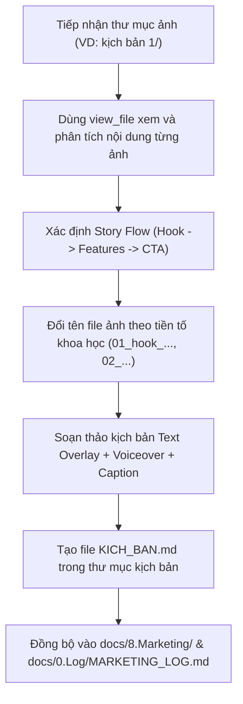

# Skill: Xây Dựng Kịch Bản TikTok & Chuẩn Hóa Bộ Ảnh (`tiktok-script-builder`) 🎬📱✨

Skill này chuyên trách vai trò **TikTok Content Strategist & Storyboard Director**. Tự động tiếp nhận các bộ ảnh chụp màn hình tính năng ứng dụng, sắp xếp thứ tự logic theo mạch kể chuyện (Story Flow), đổi tên file khoa học, xây dựng kịch bản chèn chữ (Text Overlay), lời thoại thuyết minh (Voiceover), ngân hàng Hook đời thường sinh viên và lưu trữ thành file `KICH_BAN.md`.

---

## 🎯 Mục Tiêu & Phạm Vi Sử Dụng

1. **Chuẩn hóa bộ ảnh**: Tự động rà soát các ảnh trong thư mục kịch bản (ví dụ `kịch bản 1/`, `kịch bản 2/`...) và đổi tên có tiền tố số thứ tự (`01_hook_...png`, `02_timeline_...png`...).
2. **Kịch bản TikTok bắt trend (Photo Carousel / Video ngắn)**:
   - **Slide 1 (Hook)**: Đánh trúng tâm lý, tạo cảm giác tò mò, FOMO, hoặc gọi tên đối tượng trực diện (*"Sinh viên năm mấy rồi mà còn chưa biết..."*).
   - **Slide 2 -> N-1 (Features & Benefits)**: Trình diễn các tính năng giải quyết nỗi đau theo cách trực quan, tạo cảm giác WOW.
   - **Slide cuối (CTA)**: Kêu gọi hành động rõ ràng (*"Dùng miễn phí tại Link Bio", "Lưu lại clip ngay"*).
3. **Đa dạng phong cách Hook**: Cung cấp cả Hook đời thường (người thật chia sẻ), Hook kỹ thuật (dân coder tự làm), và Hook hài hước/tiếc nuối.
4. **Đồng bộ tư liệu tiếp thị**: Tự động lưu `KICH_BAN.md` vào thư mục kịch bản và đồng bộ vào `docs/8.Marketing/` cùng `docs/0.Log/MARKETING_LOG.md`.

---

## 📋 Quy Trình Thực Hiện Chuẩn (Step-by-Step Workflow)

---

### Bước 1: Khám Phá & Phân Tích Bộ Ảnh
- Sử dụng `list_dir` để duyệt danh sách ảnh trong thư mục kịch bản được chỉ định.
- Sử dụng `view_file` để xem chi tiết giao diện/nội dung từng ảnh.
- Phân tích:
  - *Bức ảnh nào có yếu tố gây tò mò / WOW mạnh nhất để làm Slide 1 (Hook)?*
  - *Các ảnh còn lại bổ trợ cho nhau theo mạch kể chuyện nào (từ tổng quan -> chi tiết -> lợi ích)?*
  - *Ảnh nào phù hợp nhất để chốt Call-To-Action ở cuối?*

---

### Bước 2: Đổi Tên File Ảnh Khoa Học
- Sử dụng lệnh PowerShell qua `run_command` để đổi tên file theo format:
  - `01_hook_<mo_ta_ngan>.png`
  - `02_<tinh_nang_1>.png`
  - `03_<tinh_nang_2>.png`
  - `...`
  - `0N_them_tiet_hoc_cta.png` (hoặc `0N_cta_<mo_ta>.png`)

---

### Bước 3: Soạn Thảo Kịch Bản Chèn Chữ & Âm Thanh
Kịch bản bắt buộc phải có đầy đủ các phần sau:

1. **Bộ Viral Hooks (Ít nhất 6-8 câu thuộc 3 nhóm)**:
   - *Nhóm 1 (Call-out Trend)*: "Sinh viên năm mấy rồi mà còn chưa biết...", "Sinh viên đại học mà chưa biết cái này..."
   - *Nhóm 2 (Đồng cảm nỗi đau)*: Bỏ thói quen cũ, nỗi đau tính điểm qua môn, nỗi đau lục tin nhắn Zalo xin tài liệu.
   - *Nhóm 3 (Bí mật phòng trọ / Chia sẻ chân thành)*: "Đứa bạn cùng phòng giấu tui...", "Ước gì biết từ năm nhất..."
2. **Chi Tiết Từng Slide**:
   - **Header Highlight**: Chữ to, nổi bật trên cùng (khung đen chữ vàng / neon).
   - **Subtext**: Mô tả ngắn gọn lợi ích thực tế ở phía dưới.
   - **Voiceover**: Lời bình đọc bằng giọng tự nhiên, thân thiện, đời thường.
3. **Caption & Hashtags Chuẩn Thuật Toán**:
   - Caption ngắn gọn, kèm câu hỏi tương tác.
   - Bộ hashtag: `#sinhvien #schedule #studytok #studyhacks #thoikhoabieu #daihoc #productivity...`
4. **Gợi Ý Nhạc Nền (Trending Sounds)**.

---

### Bước 4: Lưu Trữ & Đồng Bộ Tài Liệu
- Tạo file `KICH_BAN.md` trực tiếp trong thư mục kịch bản.
- Sao lưu một bản vào `docs/8.Marketing/KICH_BAN_TIKTOK_<N>.md`.
- Ghi nhận ENTRY mới vào `docs/0.Log/MARKETING_LOG.md`.
- Ghi nhật ký kỹ thuật vào `docs/0.Log/WORKLOG.md`.
- Commit và push thay đổi lên Git repository.
