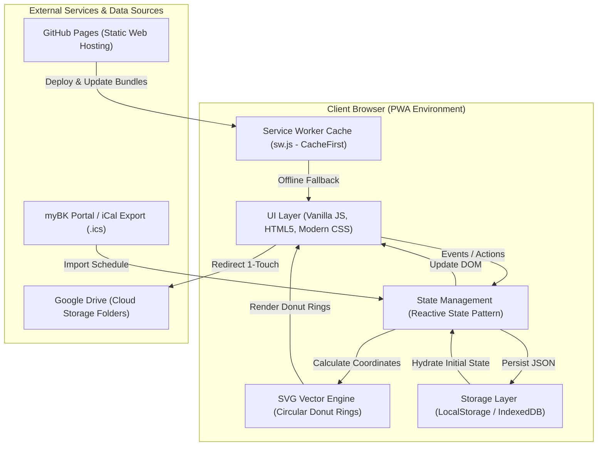
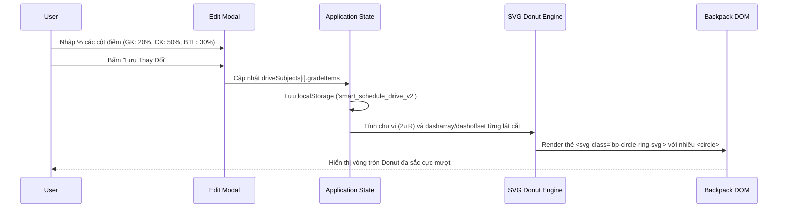

# KIẾN TRÚC HỆ THỐNG (SYSTEM ARCHITECTURE) 🏗

> **Dự án**: Lịch Học Thông Minh & Chiếc Cặp Google Drive  
> **Kiến trúc**: Client-Side Offline-First PWA (Progressive Web App)  
> **Người phụ trách**: `Architecture Employee (AI Agent)`

---

## 🏛 1. MÔ HÌNH KIẾN TRÚC TỔNG THỂ (HIGH-LEVEL DESIGN)

Hệ thống được thiết kế theo mô hình **Client-Side SPA / PWA (Single Page Application - Progressive Web App)** với cơ chế lưu trữ **Offline-First**. Người dùng có thể sử dụng toàn bộ tính năng mà không phụ thuộc vào máy chủ trung gian.

---

## 🧩 2. CÁC TẦNG KIẾN TRÚC (ARCHITECTURAL LAYERS)

### 2.1. Presentation Layer (Giao diện người dùng)
- **Công nghệ**: HTML5 Semantic + Vanilla CSS3 (Custom Properties, Flexbox, CSS Grid, Glassmorphism, Micro-animations).
- **Thành phần chính**:
  - `Timetable Matrix View`: Hiển thị ma trận tuần/tiết học theo thời gian thực.
  - `Circular Backpack Node Engine`: Vẽ các node tròn kèm SVG Donut Ring phân bổ % tỉ lệ điểm.
  - `Jiggle Mode Engine`: Xử lý tương tác Long-press (500ms), rung phản hồi (Vibration API) và quản lý trạng thái hiển thị nút thao tác.
  - `Grade Target Calculator View`: Giao diện nhập điểm quá trình và giải nghiệm điểm thi cuối kỳ.

### 2.2. State Management Layer (Quản lý trạng thái)
- Cấu trúc `state` trung tâm lưu trữ toàn bộ dữ liệu ứng dụng:
  - `currentTab`: Tab đang hiển thị (`timetable`, `backpack`, `grades`).
  - `selectedWeek`: Tuần học đang chọn.
  - `driveSubjects`: Danh sách môn học, link Drive và mảng `gradeItems` (% điểm).
  - `scheduleData`: Dữ liệu lịch học theo tiết, thứ, phòng, giảng viên.
  - `isJiggleMode`: Trạng thái bật/tắt chế độ rung lắc chỉnh sửa.

### 2.3. Offline & Caching Layer (PWA & Service Worker)
- File `sw.js` sử dụng chiến lược **Cache-First** cho toàn bộ assets tĩnh (HTML, CSS, JS, Fonts, Icons) và **Network-First** khi kiểm tra bản cập nhật mới từ GitHub Pages.
- Cung cấp `manifest.json` chuẩn W3C cho phép "Thêm vào màn hình chính" (Add to Home Screen) trên cả iOS Safari và Android Chrome.

---

## 🔄 3. LUỒNG DỮ LIỆU CHÍNH (KEY DATA FLOWS)

### 3.1. Luồng vẽ và cập nhật Circular Donut Ring:

---

## 🔮 4. KHẢ NĂNG MỞ RỘNG TRONG TƯƠNG LAI (PHASE 2 & PHASE 3)

- **Giai đoạn 2 (Backend & Security)**: Nếu mở rộng sang đồng bộ đám mây đa thiết bị, có thể bổ sung kiến trúc Backend Node.js / Express + PostgreSQL kèm Google OAuth2 token.
- **Giai đoạn 3 (Performance & Sync)**: Bổ sung IndexedDB để chứa hàng trăm tài liệu offline, Service Worker Push Notifications cho chuông báo vào tiết.
