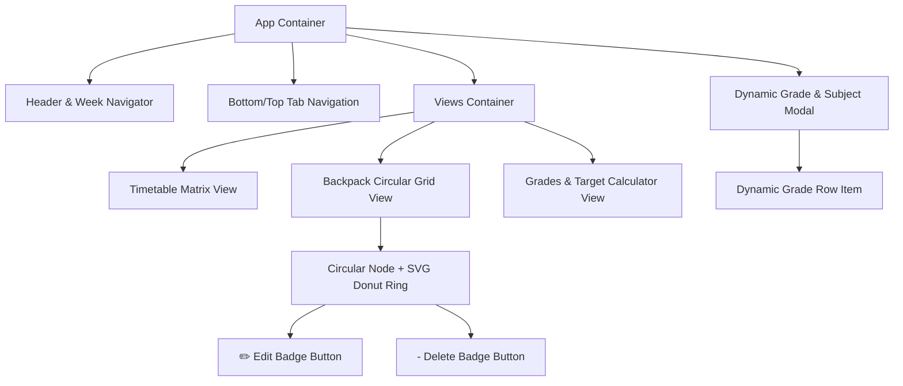

# ĐẶC TẢ THÀNH PHẦN GIAO DIỆN (COMPONENT SPECIFICATIONS) 🧩

> **Dự án**: Lịch Học Thông Minh & Chiếc Cặp Google Drive  
> **Người phụ trách**: `Frontend Employee (AI Agent)`

---

## 📦 1. DANH SÁCH CÁC COMPONENT CỐT LÕI



---

## 🔍 2. CHI TIẾT TỪNG COMPONENT

### 2.1. Circular Backpack Node (`.bp-circle-item`)
- **Mô tả**: Hiển thị môn học dạng hình tròn với vòng Donut Ring chia tỉ lệ điểm bao quanh.
- **Cấu trúc DOM**:
  ```html
  <div class="bp-circle-item [jiggle-active]" data-code="CO3117">
    <button class="btn-delete-node-badge">-</button>
    <button class="btn-edit-node-pencil">✏️</button>
    
    <div class="bp-circle-wrapper">
      <svg class="bp-circle-ring-svg" viewBox="0 0 100 100">
        <!-- Vòng nền mờ -->
        <circle class="bp-ring-bg" cx="50" cy="50" r="40"></circle>
        <!-- Các lát cắt điểm số -->
        <circle class="bp-ring-slice" cx="50" cy="50" r="40" stroke="#3b82f6" stroke-dasharray="75.4 251.3" stroke-dashoffset="0"></circle>
        <circle class="bp-ring-slice" cx="50" cy="50" r="40" stroke="#ec4899" stroke-dasharray="125.6 251.3" stroke-dashoffset="-75.4"></circle>
      </svg>
      <div class="bp-circle-core">
        <span class="bp-circle-code">CO3117</span>
        <span class="bp-circle-name">TK Hệ Thống Số</span>
      </div>
    </div>
  </div>
  ```
- **Hành vi (Interactions)**:
  - `Click`: Nếu không ở Jiggle Mode $\rightarrow$ Mở liên kết Google Drive tương ứng trong tab mới.
  - `Long-Press (500ms)` / `Right-Click`: Kích hoạt Jiggle Mode, hiện nút ✏️ và nút `-`.
  - `Click vào ✏️`: Mở `edit-drive-modal` để chỉnh sửa thông tin và tỉ lệ điểm môn học.
  - `Click vào -`: Hiển thị xác nhận xóa môn khỏi Chiếc Cặp.

---

### 2.2. Dynamic Grade Breakdown Modal (`#edit-drive-modal`)
- **Mô tả**: Hộp thoại chỉnh sửa thông tin môn học, link Drive và cấu trúc % điểm động.
- **Thành phần con**:
  - `Tên môn học` & `Mã môn học` (Input text).
  - `Link thư mục Google Drive` (Input URL).
  - `Danh sách cột điểm`: Gồm các dòng động (Tên cột, Tỉ lệ %, Màu sắc, Nút xóa dòng).
  - `Badge tổng điểm`: Hiển thị tổng % hiện tại kèm màu sắc cảnh báo (`100%` - Xanh lá, `≠ 100%` - Đỏ).
  - `Nút + Thêm cột điểm`: Thêm 1 hàng mới với giá trị mặc định.
  - `Nút Lưu Thay Đổi`: Cập nhật lại state và vẽ lại Donut Ring ngay lập tức.

---

### 2.3. Timetable Matrix Grid (`.timetable-grid`)
- **Mô tả**: Bảng lưới 7 ngày (Thứ 2 - CN) kết hợp 12 tiết học (Sáng 1-6, Chiều 7-12).
- **Trạng thái đặc biệt**:
  - Ô đang diễn ra tiết học: Viền phát sáng ánh đèn Neon Pulse.
  - Ô có môn học: Thẻ kính bán trong suốt hiển thị tên môn, phòng học, mã lớp.
