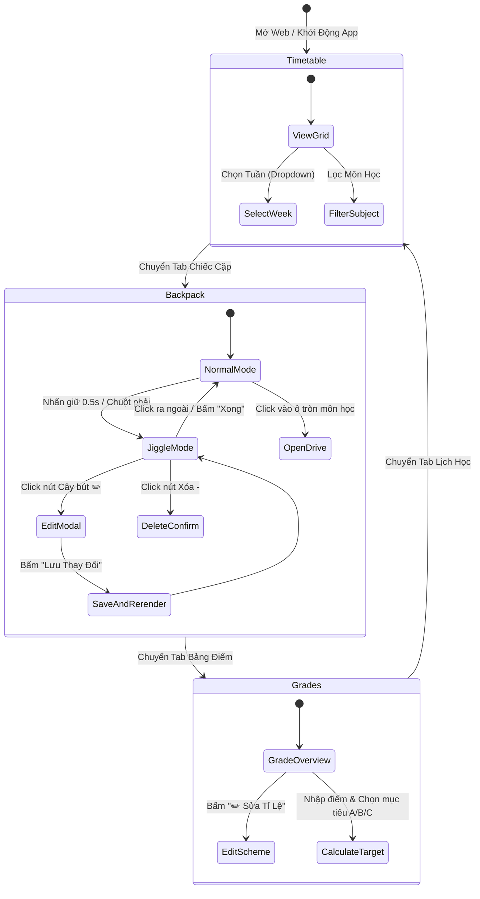

# LUỒNG GIAO DIỆN & TRẠNG THÁI MÀN HÌNH (UI WIREFRAME & FLOW) 📱

> **Dự án**: Lịch Học Thông Minh & Chiếc Cặp Google Drive  
> **Người phụ trách**: `Frontend Employee (AI Agent)`

---

## 🗺 1. SƠ ĐỒ CHUYỂN TRANG & ĐIỀU HƯỚNG (NAVIGATION FLOW)

---

## 📱 2. ĐẶC TẢ CÁC TRẠNG THÁI GIAO DIỆN (UI STATES)

### 2.1. Trạng thái Chiếc Cặp - Chế độ Xem Thường (Normal Mode)
- Toàn bộ danh sách môn học hiển thị dưới dạng lưới các vòng tròn gọn gàng.
- Mỗi môn gồm vòng Donut Ring nhiều màu rực rỡ và tên môn ở chính giữa.
- **Tuyệt đối không có nút cây bút hay nút xóa che mắt**, tạo trải nghiệm thẩm mỹ tối đa.

### 2.2. Trạng thái Chiếc Cặp - Chế độ Rung Lắc Chỉnh Sửa (Jiggle Mode)
- Tất cả các vòng tròn rung nhẹ qua lại (animation `@keyframes jiggle`).
- Nút tròn đỏ `(-)` nảy ra ở góc trên-trái mỗi môn.
- Nút tròn vàng `(✏️)` nảy ra ở góc trên-phải mỗi môn.
- Nút hành động nổi bật `"✓ Xong"` xuất hiện ở góc trên màn hình để thoát chế độ.

### 2.3. Trạng thái Modal Soạn Thảo Tỉ Lệ Điểm (Dynamic Modal)
- Hiển thị danh sách các hàng tỉ lệ điểm với thanh trượt hoặc ô nhập số.
- Nhập thay đổi số % $\rightarrow$ Badge tổng tự động tính toán tức thời (Live Reactive Check).
- Nút "+ Thêm cột điểm" cho phép tạo nhanh các cột như: Báo cáo Lab, Thuyết trình, Quiz online...
