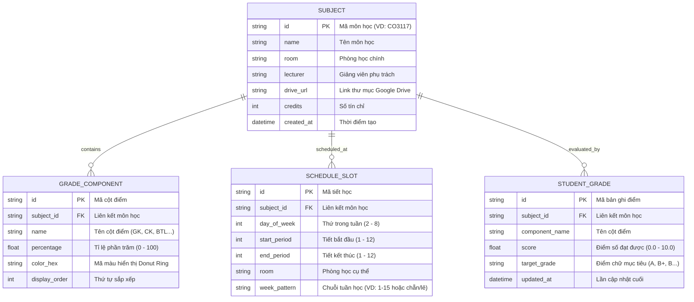

# SƠ ĐỒ QUAN HỆ THỰC THỂ (ERD DIAGRAM) 🗄

> **Dự án**: Lịch Học Thông Minh & Chiếc Cặp Google Drive  
> **Người phụ trách**: `Database Employee (AI Agent)`

---

## 📊 1. SƠ ĐỒ ERD CHI TIẾT (MERMAID)

---

## 🔗 2. MỐI QUAN HỆ GIỮA CÁC THỰC THỂ

1. **SUBJECT - GRADE_COMPONENT (1 - Nhiều)**:
   - Mỗi môn học có 1 hoặc nhiều cột điểm thành phần với tổng phần trăm bằng 100%.
   - Khi xóa môn học, toàn bộ cột điểm cấu hình của môn đó sẽ được dọn dẹp theo cơ chế Cascade.

2. **SUBJECT - SCHEDULE_SLOT (1 - Nhiều)**:
   - Một môn học có thể có nhiều buổi học trong tuần (ví dụ: Thứ 2 học Lý thuyết, Thứ 5 học Thực hành).

3. **SUBJECT - STUDENT_GRADE (1 - Nhiều)**:
   - Lưu trữ lịch sử điểm số thực tế và mục tiêu điểm chữ của sinh viên đối với môn học đó.
