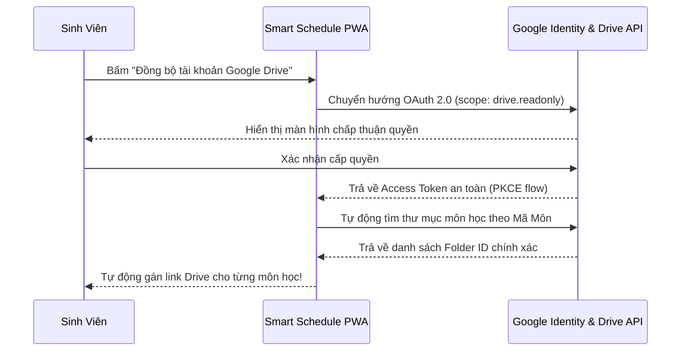

# ĐẶC TẢ XÁC THỰC VÀ MA TRẬN PHÂN QUYỀN (AUTH & RBAC SPECIFICATION) 🔑

> **Dự án**: Lịch Học Thông Minh & Chiếc Cặp Google Drive  
> **Giai đoạn**: Phase 2 Blueprint  
> **Người phụ trách**: `Security Employee (AI Agent)`

---

## 👥 1. MA TRẬN PHÂN QUYỀN (RBAC MATRIX)

| Hành Động / Tài Nguyên | Sinh Viên Khách (Guest / Local) | Sinh Viên Đăng Nhập (OAuth2 Sync) | Quản Trị Viên Hệ Thống (Admin) |
| :--- | :---: | :---: | :---: |
| **Xem Thời Khóa Biểu Cục Bộ** | ✅ Cho phép | ✅ Cho phép | ✅ Cho phép |
| **Tùy biến Chiếc Cặp & Donut Ring**| ✅ Lưu trên máy | ✅ Đồng bộ Đám mây | ✅ Cho phép |
| **Tính Điểm Mục Tiêu** | ✅ Cho phép | ✅ Cho phép | ✅ Cho phép |
| **Đồng bộ Lịch từ myBK Portal** | ✅ Import thủ công | ✅ Tự động qua API | ✅ Cho phép |
| **Quản trị cấu trúc môn mẫu chung** | ❌ Chặn | ❌ Chặn | ✅ Toàn quyền |

---

## 🔄 2. LUỒNG XÁC THỰC GOOGLE OAUTH 2.0 (PHASE 2 ROADMAP)

